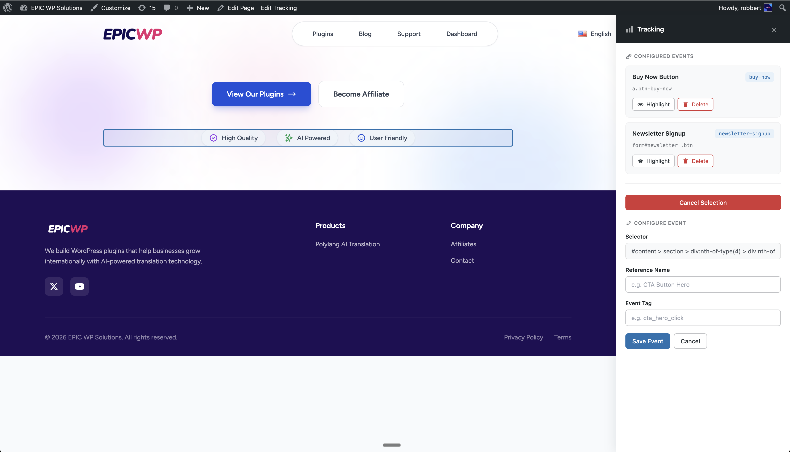
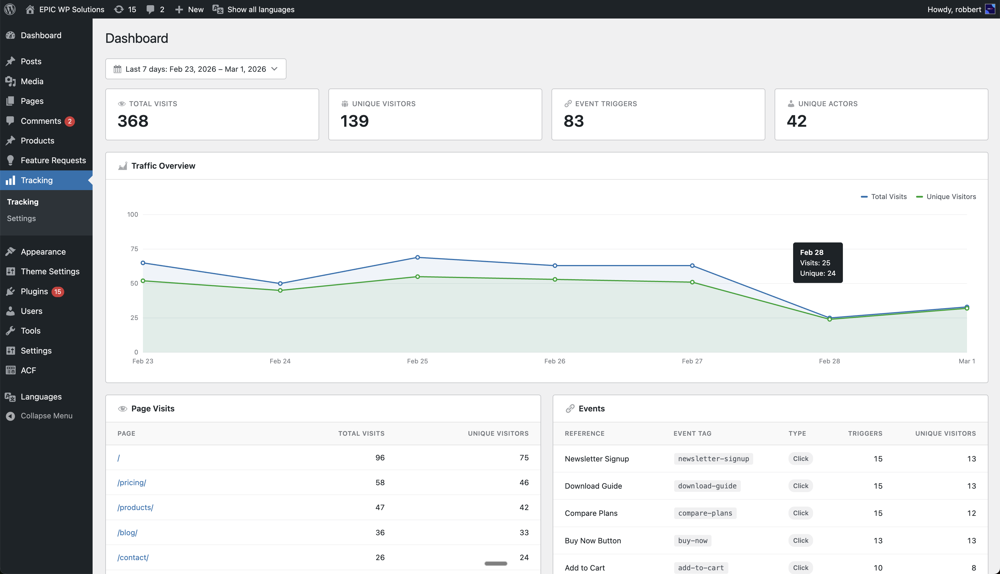
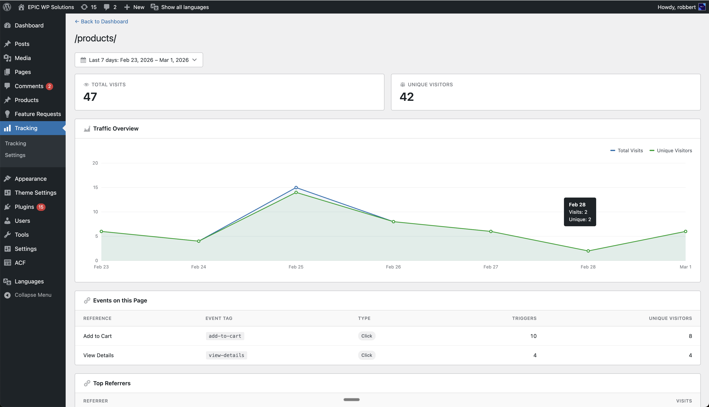

# Epic Tracking – Easy Event Tracking

Easy event tracking for WordPress. Point, click, and track — no code, no tag managers, no third-party scripts.

## Visual event editor

Set up click tracking without writing a single line of code. Open the visual editor on any page, click the element you want to track, and save.

## Track clicks on any element

Open the visual editor, click the button or link you want to track, give it a name and tag, and save. Epic Tracking handles the rest — no code, no Google Tag Manager, no external services.

- Track button clicks, form submissions, link clicks, and any other element
- Set up events visually by clicking on your live site
- View per-event trigger counts and unique visitors
- All data stays in your WordPress database

## Built-in analytics dashboard

See visits, events, referrers, devices, browsers, operating systems, and countries — all from your WordPress admin.

Drill down into any page to see its traffic, events, and visitor breakdown.

## Features

- **Visual event editor** — Point-and-click setup for tracking clicks on any element. No code or tag managers needed.
- **Event analytics** — See which events fire most, with trigger counts and unique visitor stats.
- **Visit tracking** — Automatic page view logging with referrer, device, browser, OS, and country data.
- **Country geolocation** — See where your visitors come from with automatic IP-based country detection.
- **Self-hosted** — All data stays in your WordPress database, no external analytics services.
- **Bot filtering** — Automatically excludes known bots and crawlers.
- **Role exclusion** — Exclude logged-in users by role from being tracked.

## Requirements

- WordPress 6.0+
- PHP 7.4+

## Installation

1. Download the latest release ZIP from [Releases](https://github.com/epicwp/epic-tracking/releases).
2. In WordPress, go to **Plugins > Add New > Upload Plugin** and upload the ZIP.
3. Activate the plugin.
4. Navigate to **Tracking** in the admin sidebar.

## License

[GPL-2.0-or-later](LICENSE)
